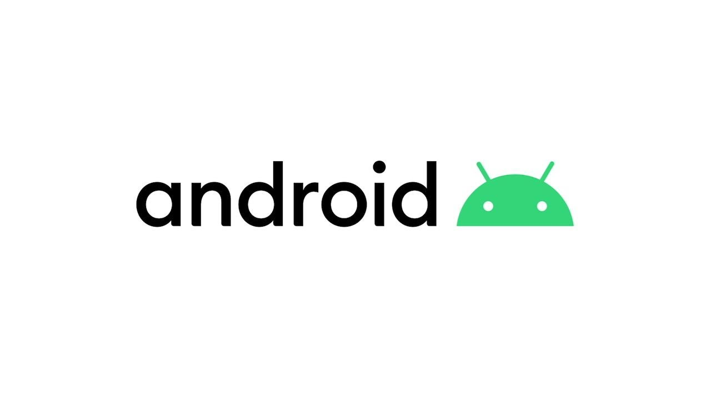

# DIO: Matches Simulator App



## :computer: Sobre

App Android Nativo de Simulação de Partidas. Este repositório foi organizado em algumas branches que representam as implementações realizadas durante os seguintes conteúdos vídeos:

1. <b>Desenvolvimento Mobile Nativo Para Android
   - [release/desenvolvimento-mobile-nativo-para-android](https://github.com/digitalinnovationone/matches-simulator-app/tree/release/desenvolvimento-mobile-nativo-para-android)
1. Componentes, Layouts e UI/UX Em Apps Android
   - [release/componentes-layouts-ui-ux-em-apps-android](https://github.com/digitalinnovationone/matches-simulator-app/tree/release/componentes-layouts-ui-ux-em-apps-android)
1. Java e Kotlin Juntos!? Construindo Apps Android
   - [release/java-e-kotlin-juntos-construindo-apps-android](https://github.com/digitalinnovationone/matches-simulator-app/tree/release/java-e-kotlin-juntos-construindo-apps-android)
1. Explorando o Firebase Para Apps Android Resilientes
   - [release/explorando-o-firebase-para-apps-android-resilientes](https://github.com/digitalinnovationone/matches-simulator-app/tree/release/explorando-o-firebase-para-apps-android-resilientes) </b>


### :keyboard: Instalação e Execução do Projeto

- Respositório do projeto

```
> git clone https://github.com/volneineves/matches-simulator-app
```

- Navegue até o diretório principal do projeto

```
> cd matches-simulator-app
```

- Abra o Android Studio na pasta

- Execute a aplicação

## :memo: Licença

Esse projeto está sob a licença MIT. Veja o arquivo [LICENSE](https://github.com/git/git-scm.com/blob/master/MIT-LICENSE.txt) para mais detalhes.

---

Feito por <a href="https://www.linkedin.com/in/volnei-neves">Volnei Neves</a> :wave:
